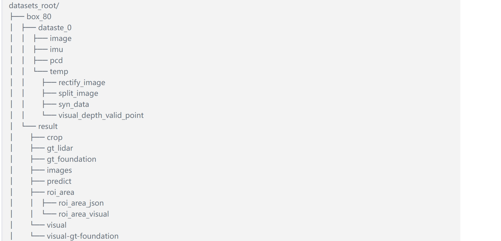
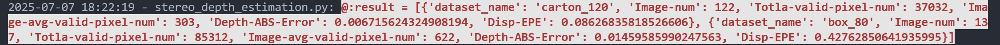
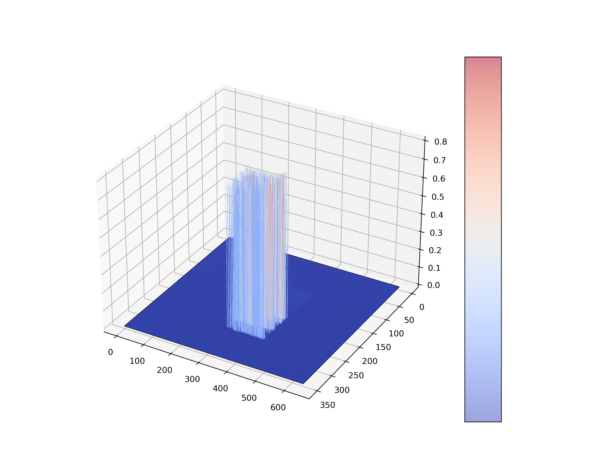
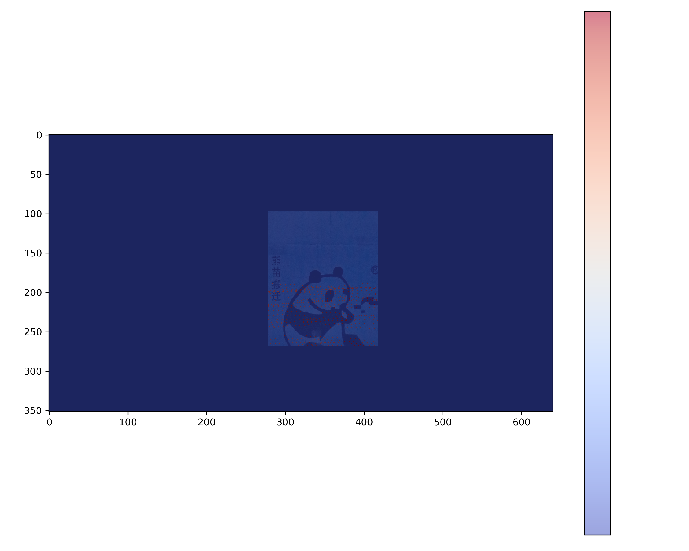
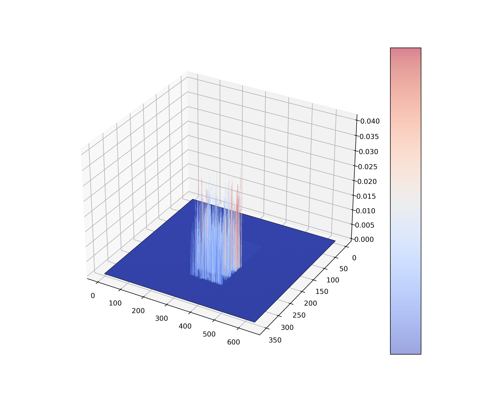
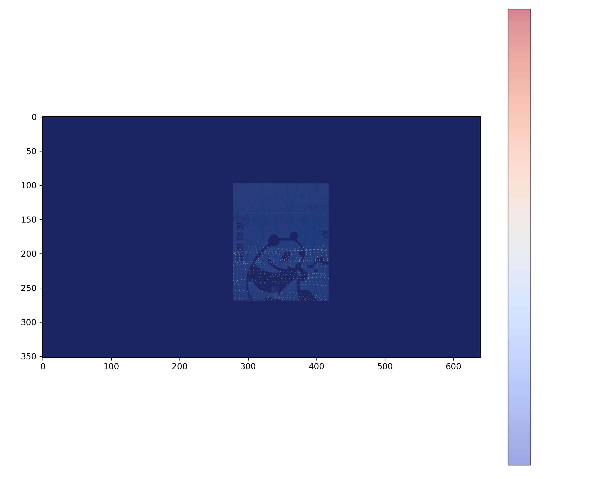

Depth_Estimation

# 注意事项

Depth_Estimation包含：双目深度预测 以及 双目深度评估， 其中双目深度预测部分依据SDK-X5-EVB发的话题数据进行数据预测（可能不适用于所有）；双目``深度评估代码具有通用性，但是要求数据按照规定的格式进行组织。

# 功能介绍

Depth_Estimation：是用于双目深度估计性能评估。

1. 评估深度深度预测算法的：视差-EPE，深度绝对偏差（后面会扩充指标）；
2. 提供评估预测(Predict) 与真值(GT)之间的偏差的2D,3D可视化图，方便查看追溯偏差大的具体位置以及偏大大概范围；
3. 提供预测预测(Predict) 与真值(GT)的2D,3D可视化图，方便查看分布情况；
4. 提供了相机内参标定模块；
5. 集成了Foundation-stereo推理模块（cpu版本），后面会集成GPU推理提供API的版本；
6. .集成了感兴趣区域大模型识别功能（目前使用第三方的API）；
7. 提供了具备全图和感兴趣区域深度评估功能；

# 数据集格式

格式示例：

1.datasets_root：存放数据集的根目录

2.box_80：数据集的名称，其数据格式必须按这种方式命名， 字符串后面的数字为采集数据使用的距离(cm)， 对于不是按照固定距离采集的数据后面的数字使用“0”代替，比如：carton_0;

3.dataset_0：数据集下面包含的子数据集， 比如同一距离各种角度采集的数据；每个子数据集下面必须包含image 和 pcd 文件夹，分布存放color图片和点云.

4.temp:  存放生成gt数据过程中间数据

* syn_data：存放激光雷达和相机时间同步后的数据
* split_image：存放同步后分离开的左右图（原始的数据是左右图纵向拼接的图）
* rectify_image：存放畸变矫正后的左右图
* visual_depth_valid_point：村点云数据映射到color上的可视化图

5.result：存放最终用于评估的数据

* gt_lidar： 存放点云转换到camera坐标系下的重命名深度图
* gt_foundation:  存放foundation stereo 预测的深度图
* images： 存放重命名后的左右图
* predict： 存放在SDK板子上面预测的深度图
* roi_area/roi_area_json:  json文件存放大模型预测的感兴趣区域结果
* roi_area/roi_area_visual：存放大模型预测的感兴趣区域可视化结果
* visual： 以gt_lidar为gt性能评估的可视化结果
* visual-gt-foundation： 以gt_foundationgt_lidar为gt性能评估的可视化结果

# 模块介绍

dds-cloudapi-sdk：通用障碍物检测模块，可以获取感兴趣区域，目前使用第三方API 。

stereo_calib： 相机标定模块，用于标定相机的内参 。

FoundationStereo： 双目深度估计大模型，在没有真值的情况，可以使用此模型的预测结果作为真值(这里代码是开源代码，由于代码太大没有上传) 。

SteroDepthEstimation： 双目深度预测评估模块. SteroDepthEstimation中已经集成各个模块，可以通过任务类型来绝对使用哪个模块。

## 使用教程

运行： 
`python main.py`

参数详解：

**--task_type**：可选的任务类型

* calib： 相机标定，生成的标定在main.py对应的目录下
* metrics： 性能测试
* foundation： 使用cpu生成基于foundation stereo的gt数据
* roi： 生成感兴趣区域
* gt： 基于激光雷达点云生成gt

**--datasets_root_dir**: 数据集的根目录

**--camera_info_path**： 相机标定文件的路径，包含相机的内参和外参数

**--time_window**： 相机和激光雷达时间对齐的搜索的时间窗口

**--time_threshold**： 相机和激光雷达时间对齐的偏差阈值

**--bin_width**： bin图像的width

**--bin_height**： bin图像的height

**--depth_min**： 深度值的最小值，单位：mm

**--depth_max**： 深度值的最大值，单位：mm

**--use_roi_area**： 是否使用感兴趣区域，使用此参数，需要先使用dds-cloudapi-sdk模块生成感兴趣区域json文件

**--use_fixed_depth**： 定于定距离测试，可以使用生成固定距离的gt深度图

**--use_history_data**： 是否使用历史数据，不使用会清楚历史产生的数据

**--debug**： 开启debug，会保存各个环节的数据，方便追溯

**--use_foundation**： 是否使用Foundation stereo的预测结果作为gt值

**--coord_offest**： 感兴趣区域的坐标偏差

--use_category:  感兴趣区域的类别

# 结果展示

性能指标：

gt-depth-3d

gt-depth-2d

predict-depth-3d

predict-depth-2d

disp-abs-error-3d

disp-abs-error-2d

depth-abs-error-3d

depth-abs-error-2d

